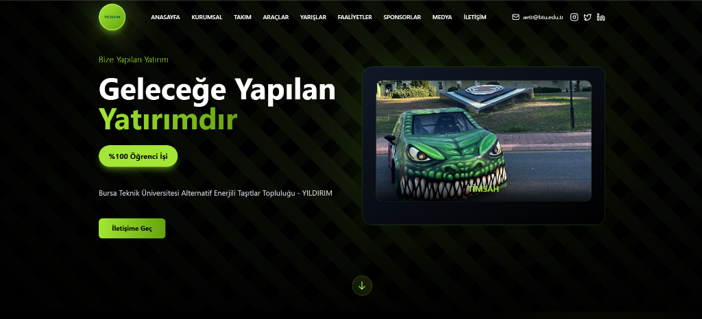
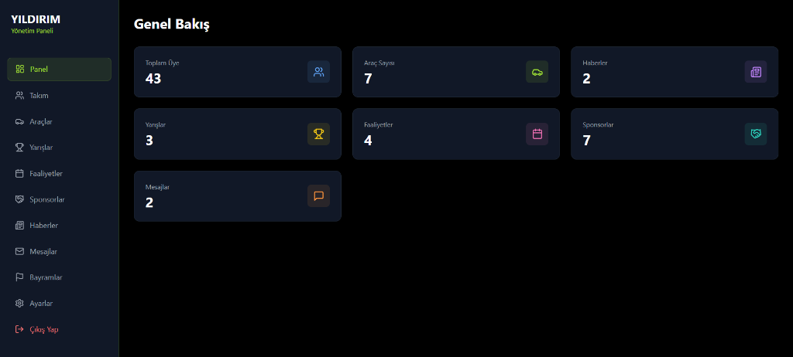
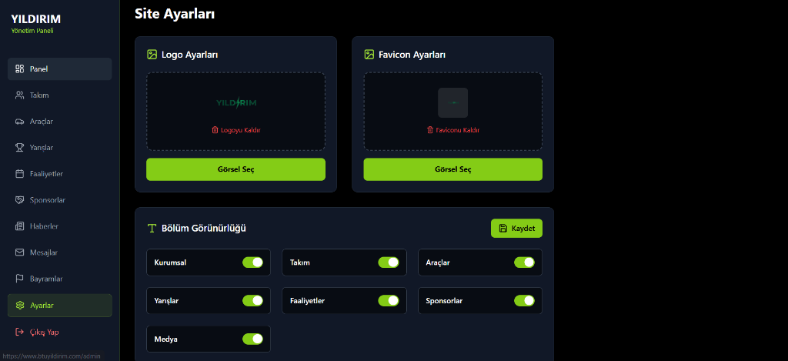
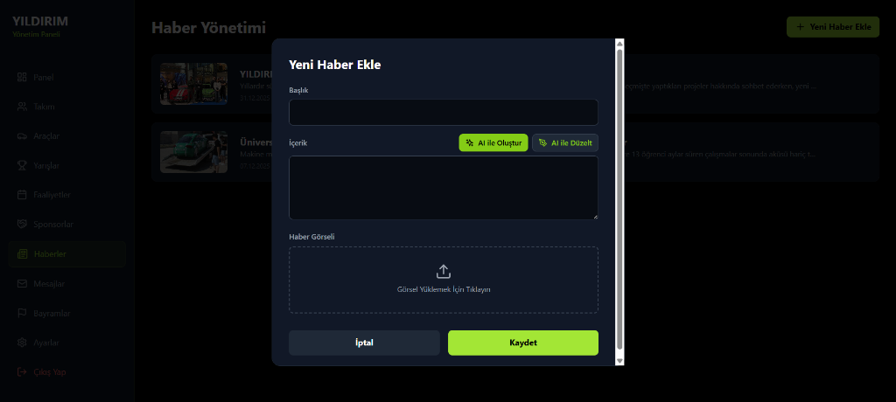

# BTU YILDIRIM - Takım Web Sitesi

Bursa Teknik Üniversitesi YILDIRIM takımının modern ve responsive web sitesi.

## 🚀 Özellikler

### 🎨 Kullanıcı Arayüzü
- **Modern Tasarım** - Koyu tema, gradient efektleri ve şık görsel hiyerarşi
- **Akıcı Animasyonlar** - Framer Motion ile sayfa geçişleri ve scroll animasyonları
- **Tam Responsive** - Mobil, tablet ve masaüstü için optimize edilmiş tasarım
- **SEO Optimizasyonu** - React Helmet ile dinamik meta taglar ve sayfa başlıkları

### 🏠 Ana Sayfa Bölümleri
- **Hero Section** - Otomatik araç slider'ı ile etkileyici açılış
- **Takım Tanıtımı** - Takım hakkında bilgi ve istatistikler
- **Araç Vitrini** - Teknik özellikler ile araç galerisi
- **Takım Kadrosu** - Marquee animasyonu ile otomatik kayan takım kartları
- **Haberler & Etkinlikler** - Dinamik haber ve etkinlik kartları
- **Yarış Sonuçları** - Katılınan yarışlar ve başarılar
- **Sponsorlar** - Sponsor logoları ve ortaklıklar
- **İletişim Formu** - EmailJS entegrasyonu ile çalışan form

### 🔧 Admin Paneli
- **Dashboard** - Genel istatistikler ve özet görünüm
- **Takım Yönetimi** - Üye ekleme, düzenleme, silme (rol ve alt grup desteği)
- **Araç Yönetimi** - Araç ve teknik özellik yönetimi
- **Haber Yönetimi** - Haber oluşturma ve düzenleme
- **Etkinlik Yönetimi** - Etkinlik takvimi yönetimi
- **Yarış Yönetimi** - Yarış sonuçları ve detayları
- **Sponsor Yönetimi** - Sponsor ekleme ve kategorizasyon
- **Mesaj Kutusu** - İletişim formundan gelen mesajlar
- **Site Ayarları** - Logo, başlıklar, açıklamalar ve sosyal medya linkleri
- **AI İçerik Asistanı** - Gemini AI ile otomatik içerik oluşturma ve metin düzeltme

### ⚡ Teknik Özellikler
- **Type-Safe** - TypeScript ile tam tip güvenliği
- **Real-time Data** - Veritabanı ile dinamik içerik yönetimi
- **Protected Routes** - Admin paneli için oturum koruması
- **Serverless Functions** - API endpoint'leri
- **Intersection Observer** - Performanslı scroll-triggered animasyonlar
- **Lazy Loading** - Optimum performans için lazy yükleme

## 🛠️ Teknolojiler

- **Frontend:** React 18 + TypeScript
- **Styling:** Tailwind CSS
- **Animasyonlar:** Framer Motion
- **Routing:** React Router v7
- **Build Tool:** Vite
- **İkonlar:** Lucide React
- **Email:** EmailJS

## 📸 Ekran Görüntüleri

### Ana Sayfa

### Admin Panel - Dashboard

### Admin Panel - Site Ayarları

### Admin Panel - Haber Yönetimi (AI Destekli)

